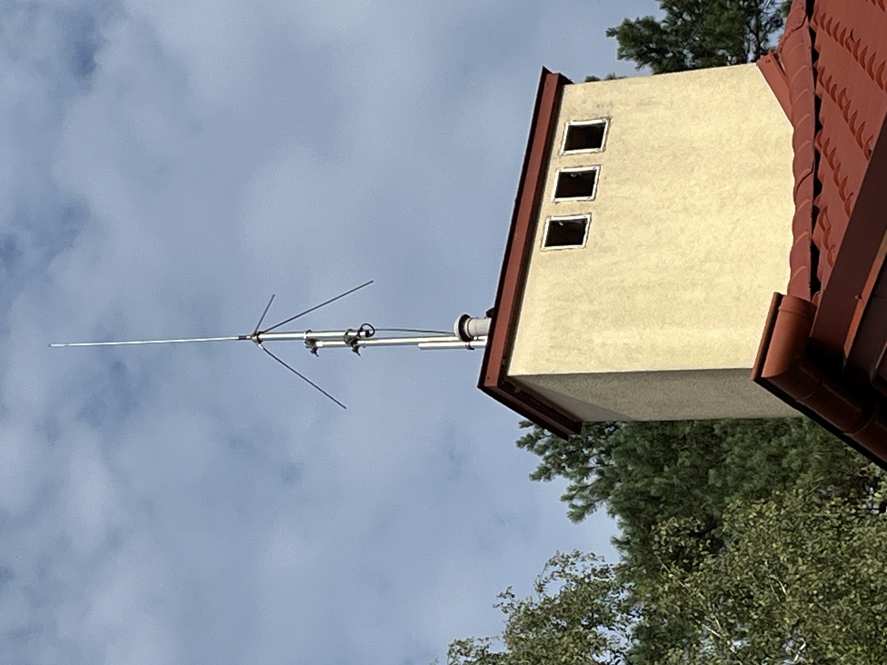
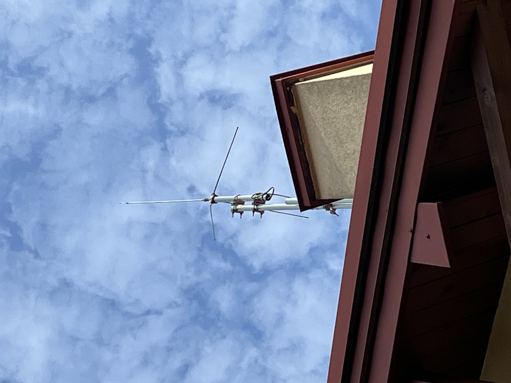

# Tunning Sirio Signal Keeper 27 for 10m Band

## Introduction
This article summarizes my experience with adapting the Signal Keeper 27, a ¼-wavelength CB band (27 MHz) base-loaded ground-plane antenna manufactured by Sirio in Italy.

I first installed this antenna last year, but after running into difficulties during the tuning process, I set it aside for almost a year. Recently, I revisited the project—and this time achieved excellent results, which I would like to share here.

With just a few simple principles, the Sirio antenna can be installed and tuned without much effort. In practice, it not only works reliably but also outperforms the half-wave end-fed antenna I have been using on the 10 m band.

## Initial Mistakes

### Stay clear from metal surfaces...
During my first attempt, I installed the Signal Keeper too close to my metal roof—only about 2 m above the surface and roughly 1.5 m from the chimney, which, although smaller, is still a significant metal structure. Antenna coupled to nearby metal surface was possible to tune but its bandwidth was very narrow compared to standard SWR curve provided by manufacturer (see next section of this document). 

### Avoid getting too close to the antenna during tuning — your body can easily detune it and shift the SWR minimum.
To make matters worse, I tried tuning the antenna while sitting on the rooftop directly beneath it, ready to make quick adjustments (with my son monitoring the NanoVNA readings in the shack). However, as soon as I left the area and checked again, the SWR minimum had shifted.

### Always tune the antenna at the feed point—the coaxial cable can transform the impedance and give misleading readings.
My final mistake was underestimating the impact of the ~20 m coaxial cable between the NanoVNA and the antenna feed point. The cable acted as an impedance transformer, which in my case led to completely misleading results—for example, shortening the radiating element caused the SWR dip to shift toward lower frequencies. At that point, I was genuinely perplexed!

### Improved mast setup enabling single-person maintenance
For easy single-person antenna maintenance, mount the antenna on a mast made of two sections joined with a pair of mast-to-mast clamps. In my setup, the taller section is fixed to the chimney using two wall brackets secured with chemical anchors (four per bracket). This arrangement makes it possible to loosen the upper mast section and slide it down to a convenient working height, providing safe and easy access to the antenna—without the need for additional help.

As you can tell from the above, I’m definitely not an antenna expert 🙂.

## Reliable Tunning Procedure

Photos of the antenna mounting can be seen below:

## Tunning

Tunning of the antenna was very simple. It was enough to reduce antenna length by about a meter at each end to achieve SWR minimum of 1.8 at 3.7Mhz. At both ends of the band SWR did not exceed 3, which meant that in practice no antenna tunner was required to operate the setup.

## Coverage Performance

It was possible to establish QSOs with entire Poland starting with stations located just a few kilometers away. The longest QSO was made with station from Bulgaria.

More tests will be carried out to confirm antenna performance especially when it comes to close proximity communication.

# Summary

In summary, I was positively surprised that so low mounted antenna can deliver solid regional coverage. Reports received were always above 57 (I was transmitting with 30-100W power using FT-710 in LSB mode).

## References
[1] Understanding NVIS - Rhode-Schwarz

[2] The NVIS— A Low Antenna for Regional  Communications - Albert L. Pion, KK7XO, QST June 2002

[3] A Look at NVIS Techniques - Ed Farmer, AA6ZM - QST January 1995