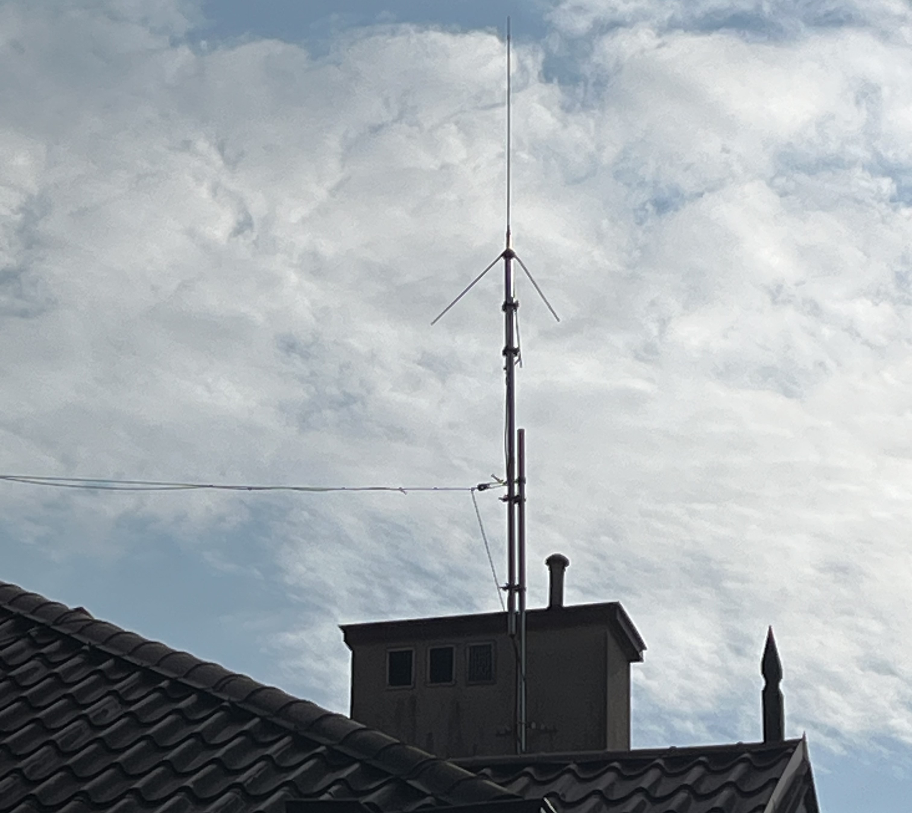
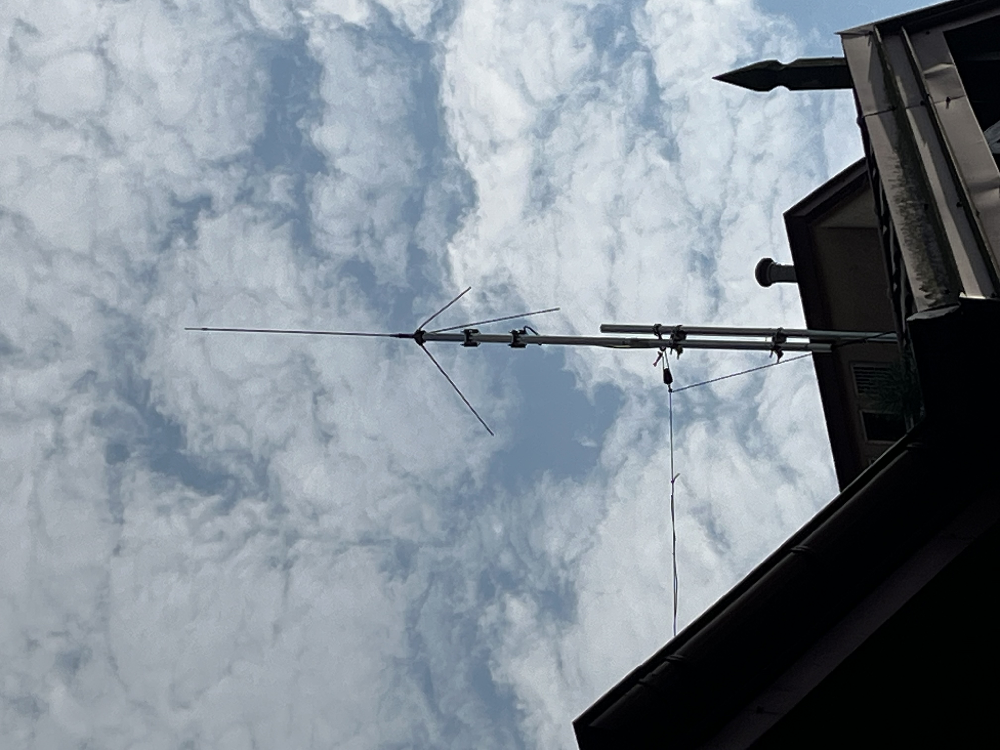
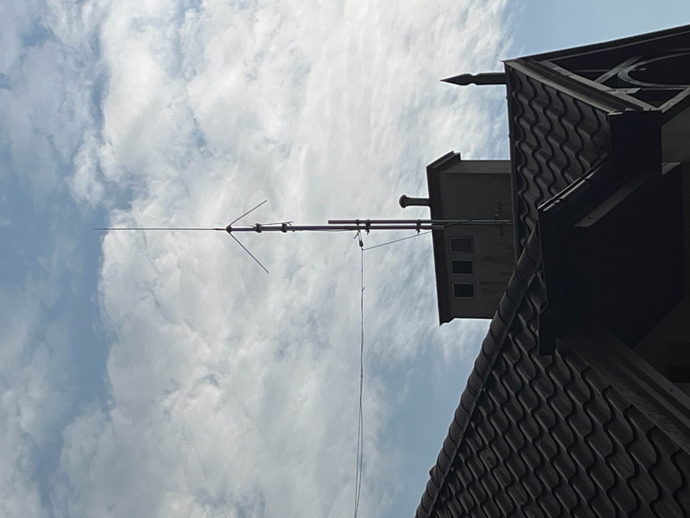
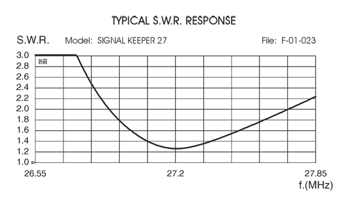

# Tunning Sirio Signal Keeper 27 for 10m Band

## Introduction
This article summarizes my experience with adapting the Signal Keeper 27, a ¼-wavelength CB band (27 MHz) base-loaded ground-plane antenna manufactured by Sirio in Italy.

I first installed this antenna last year, but after running into difficulties during the tuning process, I set it aside for almost a year. Recently, I revisited the project—and this time achieved excellent results, which I would like to share here.

With just a few simple principles, the Sirio antenna can be installed and tuned without much effort. In practice, it not only works reliably but also outperforms the half-wave end-fed antenna I have been using on the 10 m band.

## Initial Mistakes

### Stay clear from metal surfaces...
During my first attempt, I installed the Signal Keeper too close to my metal roof—only about 2 m above the surface and roughly 1.5 m from the chimney, which, although smaller, is still a significant metal structure. Antenna coupled to nearby metal surface was possible to tune but its bandwidth was very narrow compared to standard SWR curve provided by manufacturer (see next section of this document). 

### Avoid getting too close to the antenna during tuning — your body can easily detune it and shift the SWR minimum.
To make matters worse, I tried tuning the antenna while sitting on the rooftop directly beneath it, ready to make quick adjustments (with my son monitoring the NanoVNA readings in the shack). However, as soon as I left the area and checked again, the SWR minimum had shifted.

### Always tune the antenna at the feed point—the coaxial cable can transform the impedance and give misleading readings.
My final mistake was underestimating the impact of the ~20 m coaxial cable between the NanoVNA and the antenna feed point. The cable acted as an impedance transformer, which in my case led to completely misleading results—for example, shortening the radiating element caused the SWR dip to shift toward lower frequencies. At that point, I was genuinely perplexed!

### Improved mast setup enabling single-person maintenance
For easy single-person antenna maintenance, mount the antenna on a mast made of two sections joined with a pair of mast-to-mast clamps. In my setup, the taller section is fixed to the chimney using two wall brackets secured with chemical anchors (four per bracket). This arrangement makes it possible to loosen the upper mast section and slide it down to a convenient working height, providing safe and easy access to the antenna—without the need for additional help.

As you can tell from the above, I’m definitely not an antenna expert 🙂.

## Reliable Tunning Procedure

STEP 1: Prepare your cabling. Make sure all connectors are reliable, and keep a set of socket/plug adapters handy to connect the NanoVNA (or any SWR meter you prefer).

STEP 2: Connect one end of the coax to NanoVNA channel 0.

STEP 3: Calibrate the NanoVNA by connecting the open/short/50 Ω standards at the far end of the coax. Yes — NanoVNA can calibrate at a point 20m away from its test port! The physical routing of the cable doesn’t matter as long as the connectors are solid and there’s no RF leakage. (For my tests, I set the frequency span to 28–30 MHz.)

STEP 4: Once calibration is complete, climb to the roof and connect the coax to the antenna.

STEP 5: Back in the shack, perform an SWR sweep. Remember, you are now measuring at the antenna feed point! Compare your SWR curve with the manufacturer’s reference (see below). If the curve appears much narrower or distorted, it may indicate unwanted coupling to nearby metal structures or other antennas.

 
 

STEP 6: Return to the roof and adjust the length of the radiating element.

Shorten the element to shift the SWR dip higher in frequency. Lengthen it to shift the dip lower.

When you’re close to your target frequency, make adjustments in a few millimeter steps: changing the radiator length by just 10 mm can shift the SWR minimum by about 80–130 kHz, depending on the antenna’s surroundings.

Repeat STEP 5–6 until you’re satisfied with the results—or until you’ve had enough of climbing up and down the roof 🙂.

My tunning results:

